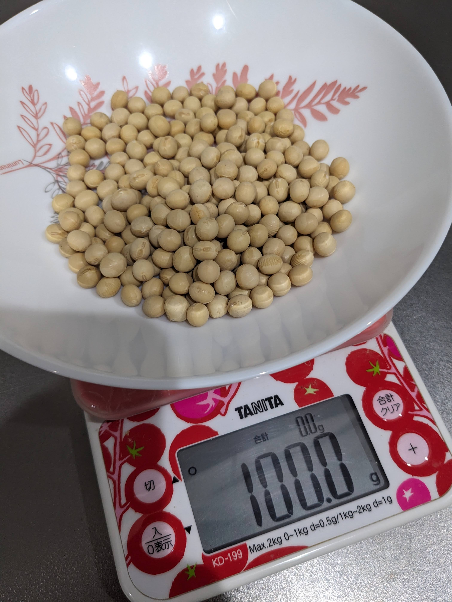
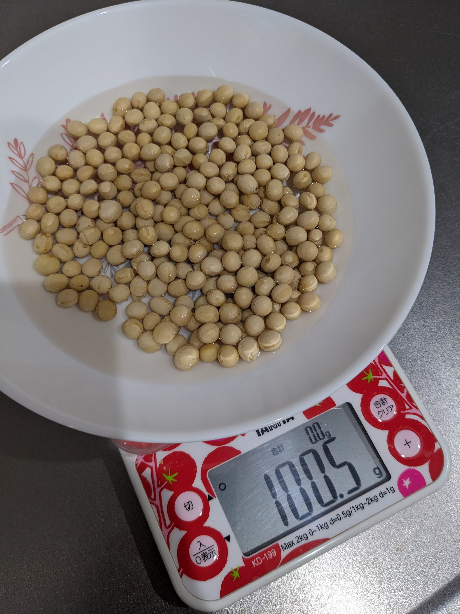
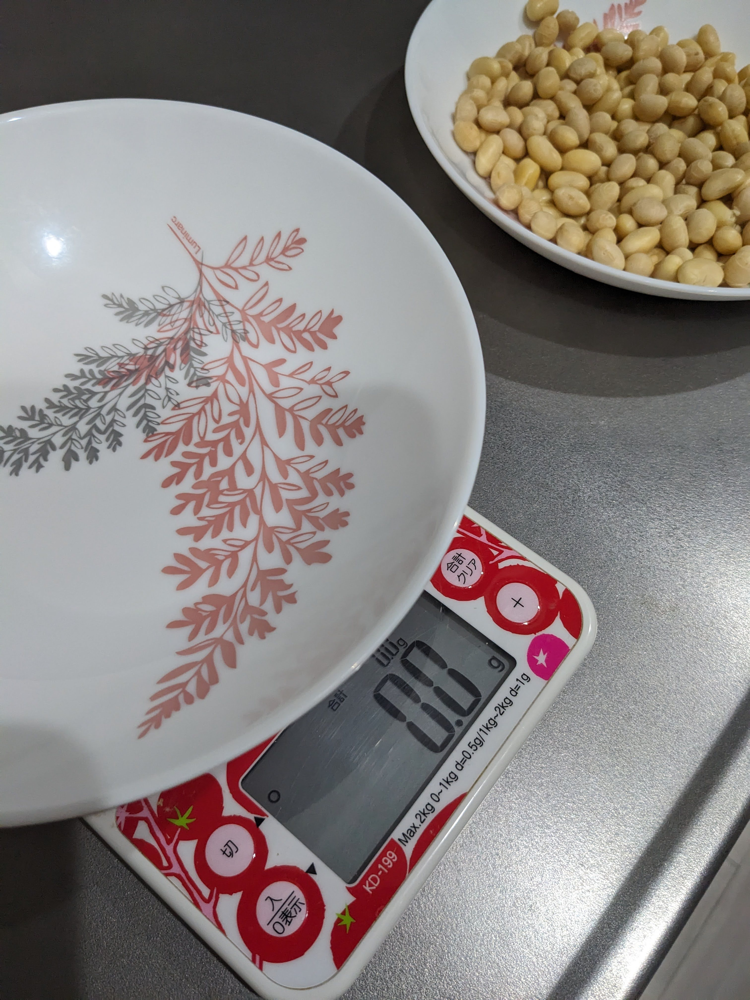
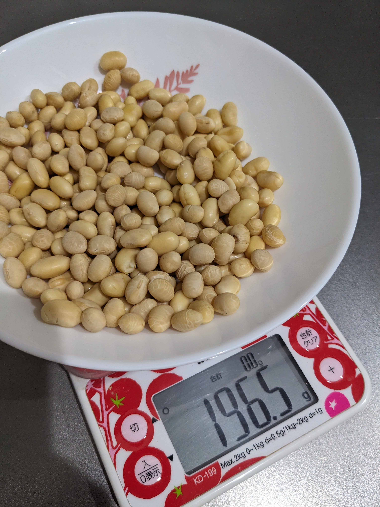
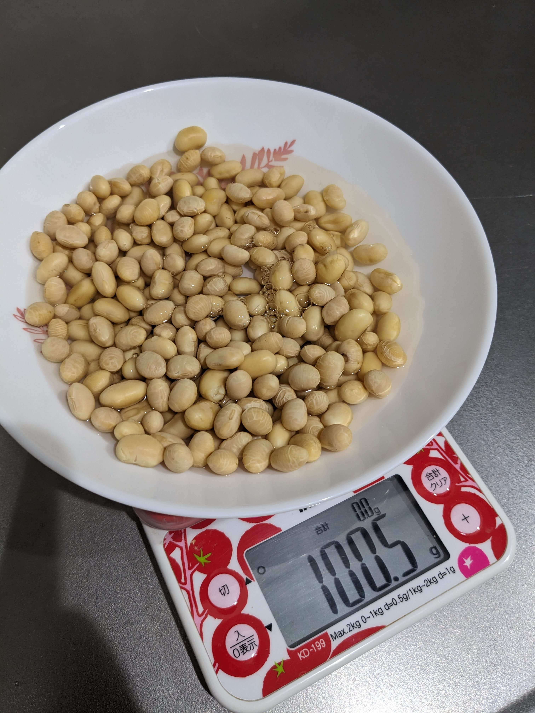
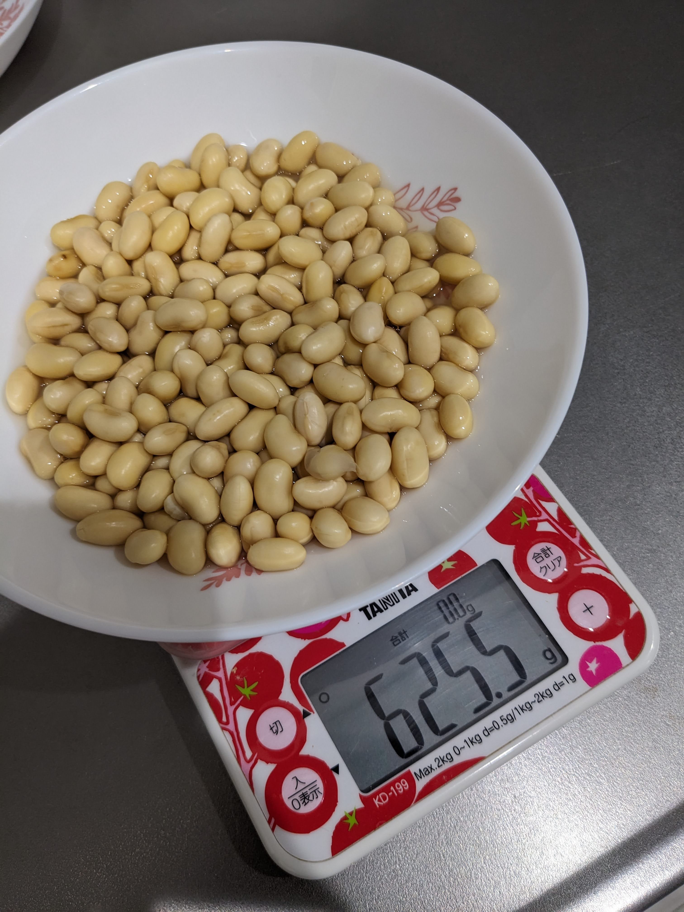
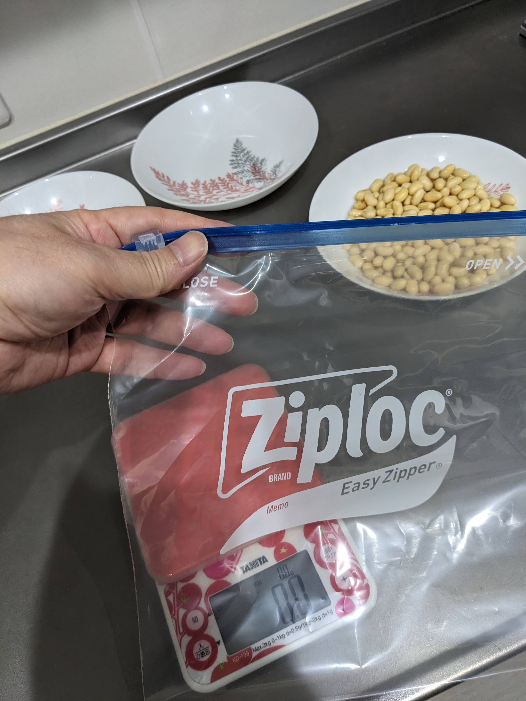
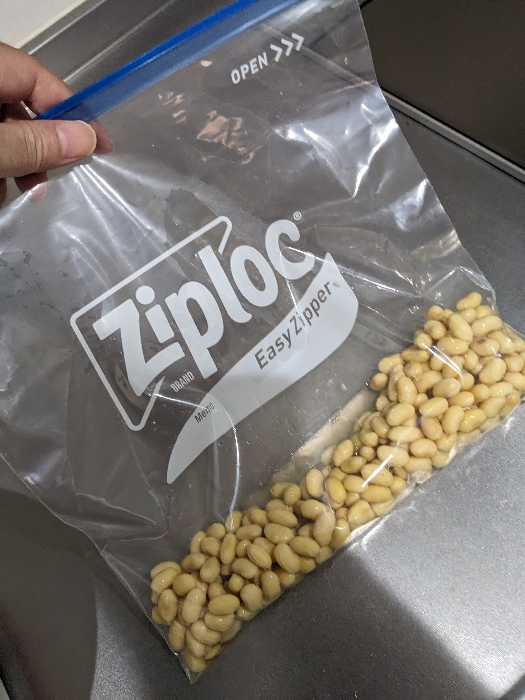

# アブストラクション
現在進行形で宇宙農場に関する原稿を執筆しているが、
今回の寄稿はタンパク質を豊富に含む栽培作物として豆類を取り上げ、その必要性と調理について考察するものとする。

結果としてタンパク質摂取源としては優秀だが主食や主菜として食すには工夫を要すものとなった。

# はじめに 〜宇宙豆類を考える〜

前項のアブストラクションを記載するにあたって…

直前に観ていたアニメ[^1] で宇宙人に攫われたかと思ったら今度は秋葉原ロボット部総統(@nanbuwks)に「アブストラクションを書け～」とメッセージをもらったので寄稿する事となった。
あくまでアブストラクションであって決してabductionではない。

そのアニメのヒロインが発した台詞に「宇宙人って何食べているんだろうね～」というものがあるが、宇宙に出た我々人類も航宙中は同じような条件になるのだろうと想定される。

そこで色々妄想が捗るのだが、考えられるものは大きく分けて３つとなる。
- 栄養剤といったケミカルマテリアル
　最も効率的で現実的だが味気なくてメンタルへの影響は避けられない
（宇宙人の中にはそういった精神や感情が欠落したものもあるかもしれないが）
- 保存可能な食糧
　現在の人類や近いメンタルをもつ生物がよく使う方法だが長期間になるとペイロードを圧迫する
- 宇宙空間で育成した原材料及びそれを使った料理
　宇宙空間では多くの場合無重力であると考えられるため調理法が要研究だが持続可能な食糧供給手段となりうる

今回は宇宙空間で育成した原材料のうち豆類に絞りそれを使った料理について書こうと思う。

筆者はオカルト好きな学生のごとく妄想が特異なので本稿も一般人の妄想として御笑覧されたい。

  

今回の寄稿は決して技術展示会で「宇宙エダマメ本あります～」と呼びかけたら立ち止まってくれる人が多かったからでもない。

# 何故宇宙で豆なのか？

宇宙空間で栽培する際にネックになりやすいのがしばしば無重力になるという点である。
そのため土を耕す必要もなく無重力でも扱いやすい水耕栽培を前提とする。

そしてタンパク質が人類の生存にとって重要な栄養素であることは言を俟たないだろう。

たんぱく源として宇宙空間で家畜を畜産するのは非効率である。（食肉1kg生産に牛肉は11kg、豚肉6㎏、鶏肉4㎏の穀物が必要 [^2]）

そのため植物栽培による原材料の確保を考えて宇宙農場の原稿を執筆しているのだが、
今回はタンパク質を豊富に含む栽培作物として豆類を取り上げるものとする。
文科省日本食品標準成分表（八訂）増補2023年第2章[^3] によれば、乾燥大豆100g当たりタンパク質36.7g
また大豆のたんぱく価は95％以上(100g中タンパク質33.8g中32.9g)でありタンパク質摂取源として優秀と思われる。

詳細は次項にて表記する。

  

# どんな豆を扱うのか？それは何故か？

今回は豆腐や大豆油などの加工食品に生かしやすく、若い豆は枝豆としても活用できる大豆を扱うものとする。
大豆は（枝豆としてだが）水耕栽培の例があるからである。また我々にとってなじみの深いものであるのも理由の一つではある。

決して秋葉原ロボット部総統から乾燥大豆を実際に使ってみてくださいと豆を戻すところからやる羽目になったからではない。

ちなみに検討した豆の栄養成分を表記する。

| |カロリーkcal/100g|炭水化物/100g|タンパク質g/100g|脂質/100g|カルシウム/100g|
|:----|:----|:----|:----|:----|:----|
|ダイズ|372|29.5|33.8|19.7|180|
|エダマメ（ゆで青大豆）|145|9.9|15|8.2|69|
|エンドウ豆|310|60.4|21.7|2.3|65|
|小豆|304|59.6|20.8|2.0|70|
| | | | | | |
|アーモンド|609|20.9|19.6|51.8|250|
|ピーナツ|573|18.8|25.4|47.5|50|
| | | | | | |

（文科省日本食品標準成分表（八訂）増補2023年第2章より）[^3] 
なおアーモンド・ピーナツは豆類ではなく種実類の分類として扱われているが、検討材料に加えてある。
ピーナツは厳密にいえば豆類だが標準成分表の分類[^4] に従った。

# 実際に豆を使ってみた
ひとまず北海道産乾燥大豆をスーパー回って見つけ出し、豆100gを用意し水100gを入れて8時間浸透させた。
その結果、豆と水が合計211gまで増加し水がほとんど無くなってしまったため更に水100gを追加し16時間追加で浸透させた。
最終的には豆と水が合計330g、残っていた水を鍋に移しても豆323gにまで増加していた。
加えた水以上に重量が増加した原因として、写真に見られるとおり発芽したことが考えられる。
食用の乾燥原材料なのに植物の生命力は凄いものだなと感じた。

  

## 豆の吸水重量について
上記の乾燥大豆の実践結果に総統から異論がついたため、乾燥大豆を水で戻す実践の追試を行った。これについて記す。

### ・事の顛末
上記にて、総統より依頼された乾燥大豆を水で戻す実践の記録を記事として前提条件や意義と共に寄稿した。
しかし記録にて、本来乾燥大豆100g+2回にわけて加えられた水の質量200gの合計と計測した総重量がほぼ変わらない結果でなくてはならないが、実際の総重量は最終的に30gほど増えてしまった。

そのことを、戻した大豆の芽が膨らんだ状態を見て発芽したものと推定し、当該誌の記事に記載した。
総統より誤差範囲ともとれないため異論が付き追試を行った。 

### ・行った追試内容
同じ秤と深皿を使用し同条件で乾燥大豆100gを水100gにつけ8時間おく

その後、水につかった大豆をかき混ぜて更に水100gを追加し8時間おく
同じ皿が当該環境に３枚あったため使用していない２枚の皿の重量をはかる
今までは豆や水の重量をはかるとき、使用していない同種の皿を使用して皿の重量を引くために０点修正を行った
しかし皿の個体重量差が懸念されたため、皿そのものの重量をはかり０点修正を行わず現物の総重量をはかった後にはかった皿の重量を引く形式とした。 

### ・追試結果
秤はTANITAのKD-199を使用したため校正の必要はないと判断

  
  
  
  
  
  
  
  
  
  

秤に皿をのせて0点修正を秤の機能によって行い、乾燥大豆100gと水100gを入れて8時間おいた
この時点で196.5gであった。
その後0点修正を使用し水100gを追加した。

  
  
  
  

追加で8時間おいた際に、同環境にあった同種の皿2枚の重量をはかる。
それぞれ333.5gと334.0gであった。
その後大豆を皿ごと重量をはかり625.5gとなった。
その後大豆と水をジップロックに移し使用した皿の重量をはかり334.5gとなった。
差し引き291.0gとなる。

### ・結論
当該誌に掲載した内容とは異なり、総重量は増えず逆に僅かに減少した。
水につける際に蓋をせずに冷蔵庫やレンジ内に置いたり途中かき混ぜたりしたため蒸発や指に水が付いたためと考えられる。
追試時との条件の差異は2回目の水につける時間が8時間多い16時間であったことと掲載内容時実践は秋口におこない追試は冬におこなったことくらいであろうか。
追試時に最終的な大豆の芽は膨らんでいなかった。
3枚の皿の重量差は最大1.0gであり秤の公称誤差は0.5gであることを考慮しても重量差は誤差範囲と考えられる。
以後実践時には、秤の0点修正機能を使わず厳密な総重量の計測を行う必要があると考えられる。
また温度条件を変えないため常に蓋をして冷蔵庫内で保管する必要もあった。
更にかき混ぜる際も洗浄したとはいえ指を使わず匙等で行い付着した水もできる限り戻す必要があると考えられる。

そして必要となる最大の改善点は、実践前に諸条件や方法を細かく依頼者と取り決めを行う必要があるということであろう。
暗黙知や不文律、界隈の常識に甘えて粗雑な伝達で実践を行うリスクが今回浮き彫りになった。
なお、実践時に水を吸った大豆の重量が23.5g増加した原因は、まだ解明されていない…
信じるか信じないかは、あなた次第です…

# 本当にクッキングへ着地できたのか
もちろん発芽までして生命力を見せてくれた大豆を料理に使わないわけにはいかない。今回は利便性を優先して鍋に入れてガスコンロにかけるが、耐熱容器に入れて電子レンジにかければ宇宙でも運用できるだろう。

鍋に戻し水（ほとんどなかったが）ごと入れて水を足し豆が浸るくらいにする。出汁スープの素大さじ１と醤油大さじ１を加えて煮立て、その後15分弱火で煮込む。

しかし食感はポリポリとしていて煮豆らしい柔らかなものとは程遠かった。
改めてネットの煮豆レシピ[^5] を見ると［1～2時間弱火で煮る］とあった。どおりで昭和の主婦が圧力なべ（圧力をかけて短い時間で煮込むことができる）を買うのだと納得した。

数日冷蔵庫で寝かせて電子レンジで3分加熱したらホクホク感が増したので繰り返せば柔らかくなるかもしれない。

  

しかしこれを毎日閉鎖空間で主菜として摂るのは現実的ではなく、筆者はピーナツのようなポリポリした豆が苦手なので実際には調理した1/10程度（タンパク質3.67g）しか一度に食べられなかった。

チリコンカンやダルカレーなどの調味を工夫する必要があると感じる。

# まとめ
乾燥大豆の取り扱いは一癖あるが、宇宙空間で生大豆を収穫できれば豆乳や大豆油に加工したりでき、いざ余剰となれば乾燥大豆にして長期保存も可能である。
執筆中の宇宙農場本[^6] では枝豆のレシピもあるため、そちらもご高覧頂きたい。

昨今大豆中心のプラントベース食生活が注目されているが、宇宙農場の可能性を広げるものとして今後も注目していきたい。
現在地上閉鎖空間で植物発芽試験を行っているが、その中に大豆もやしも入れていきたいと考えている。
また、主菜として活躍でき宇宙空間でも僅かなスパイス補給だけで調理できるレシピの開発が必要だと感じたため、進めていきたい。

  

# 参考文献

[^1] ジャンプ＋　及び　TVアニメ　「ダンダダン」　https://anime-dandadan.com/

[^2] 農水省　食糧自給率のお話　その2　お肉の自給率　https://www.maff.go.jp/j/zyukyu/zikyu_ritu/ohanasi01/01-04.html

[^3] 文科省日本食品標準成分表（八訂）増補2023年第2章 https://www.mext.go.jp/a_menu/syokuhinseibun/mext_00001.html

[^4] 上記成分表付属資料 110P https://www.mext.go.jp/content/20230428-mxt_kagsei-mext_00001_011.pdf

[^5] みんなのきょうの料理　https://www.kyounoryouri.jp/recipe/18881_%E7%85%AE%E8%B1%86.html

[^6] 拙著　SpaceFarmProject  https://github.com/busyoucow/spacefarm/tree/main 

